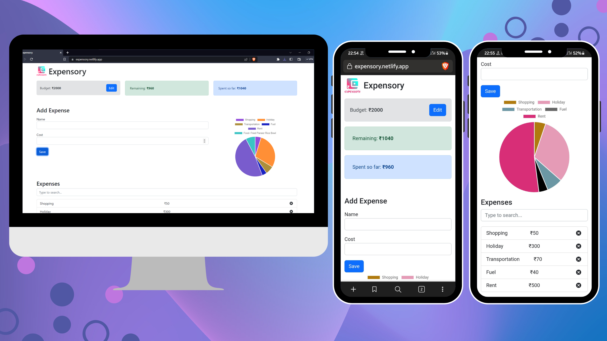

  

<h1 align="center">DeX-Crypto</h1>

Expensory-Web is a React JS based web application for tracking expenses. It allows users to easily record their expenses and manage their budget. The application provides a simple and intuitive interface that makes it easy to add, edit, and delete expenses.

 

 

    

 

## Live Deployment

- [Expensory-Web](https://expensory.netlify.app/)

## Tech stack

- React JS
- Context API
- React Hooks
- React Router
- React Bootstrap
- React Icons
- Chart JS

## Features

- Add and delete expenses
- Set a budget
- View expenses in a list and chart format
- Responsive design

